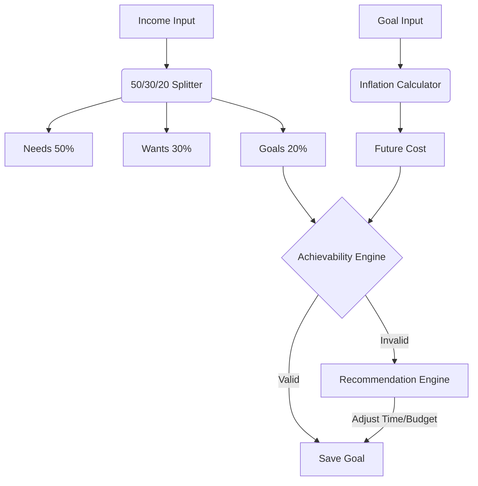

# UML (Data Flow)

```mermaid
graph TD
    A[Income Input] --> B(50/30/20 Splitter)
    B --> C[Needs 50%]
    B --> D[Wants 30%]
    B --> E[Goals 20%]
    
    F[Goal Input] --> G(Inflation Calculator)
    G --> H[Future Cost]
    
    E --> I{Achievability Engine}
    H --> I
    
    I -->|Valid| J[Save Goal]
    I -->|Invalid| K[Recommendation Engine]
    K -->|Adjust Time/Budget| J
```
